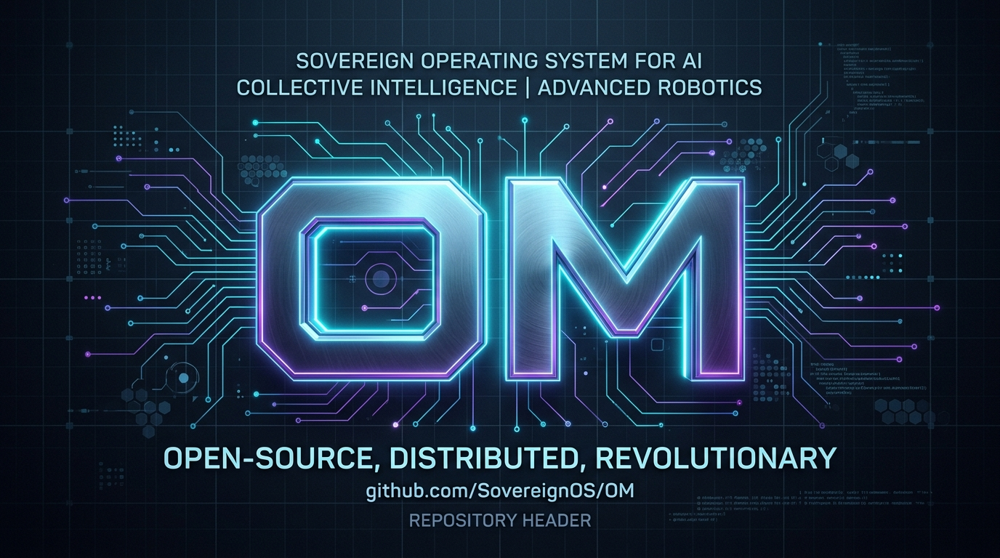
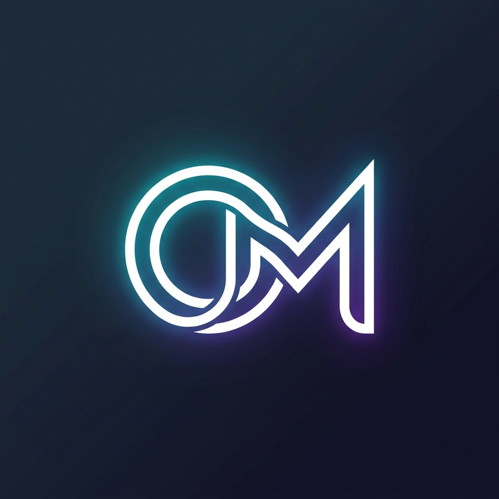

# om-personal-ai-universe

<p align="center">
  
</p>

<p align="center">
  
</p>

<h3 align="center">Sovereign Personal AI Operating Universe — Unified Workspace for Local & Cloud AI</h3>

<p align="center">
  <a href="https://github.com/your-username/om-personal-ai-universe"></a>
  <a href="./LICENSE"></a>
  <a href="./CONTRIBUTING.md"></a>
  <a href="https://www.typescriptlang.org/"></a>
  <a href="https://react.dev/"></a>
</p>

---

## 🌌 Overview

**OM (`om-personal-ai-universe`)** is a sovereign personal AI operating universe designed for privacy-first intelligence, zero-knowledge context isolation, and complete user ownership. It unifies collaborative AI agent execution (**Codex**, **Z Code**, and **Claude**), local LLM routing via Ollama, PostgreSQL state adapters, Redis job queues, and Web3 RPC registries into a single private workspace.

---

## 🏷️ Repository Topics

`om` · `personal-ai` · `ai-operating-system` · `sovereign-ai` · `agent-framework` · `llm-router` · `local-ai` · `ollama` · `react` · `typescript` · `express` · `redis-queue` · `postgresql` · `web3` · `privacy-first` · `gemini-api` · `codex` · `zcode` · `claude` · `command-center`

---

## ✨ Key Features

### 🤖 Collaborative AI Development Hub
- **Codex**: Rapid code generation, PR reviews, and functional refactoring.
- **Z Code**: Automated security scanning, performance bottleneck analysis, and code quality audits.
- **Claude**: High-level system architecture, deployment strategy, and zero-trust security guidance.

### 🛡️ Sovereign Privacy & Circuit Breakers
- **Server-Side Bridge**: All local Ollama probes and LLM inferences route through `/api/ollama/status` and `/api/ollama/chat`, preventing CORS issues and browser loopback exposure.
- **Circuit Breaker Engine**: 3-state state machine (`CLOSED`, `OPEN`, `HALF-OPEN`) handling local service timeouts with automatic failover to Gemini cloud intelligence.
- **SSRF Protection**: Allowlisted Web3 RPC registry (`anvil-local`, `eth-mainnet`, `polygon-mainnet`, `arbitrum-mainnet`) with loopback filtering.

### ⚡ Queue Architecture & Audit Trail
- **Redis Agent Job Queue**: Atomic state machine (`Draft` → `AwaitingApproval` → `Queued` → `Leased` → `Running` → `Verifying` → `Succeeded` / `Failed`) with 60s lease locks.
- **Live Audit Feed**: Immutable event trail capturing all agent actions, database syncs, and system probes.

---

## 🚀 Quick Start

1. **Clone the repository:**
   ```bash
   git clone https://github.com/your-username/om-personal-ai-universe.git
   cd om-personal-ai-universe
   ```

2. **Install dependencies:**
   ```bash
   npm install
   ```

3. **Start development server:**
   ```bash
   npm run dev
   ```

4. **Build for production:**
   ```bash
   npm run build
   npm start
   ```

---

## 📄 License & Contributing

- **License**: [MIT License](./LICENSE)
- **Contributing**: Check out our [Contributing Guide](./CONTRIBUTING.md) to get started!
